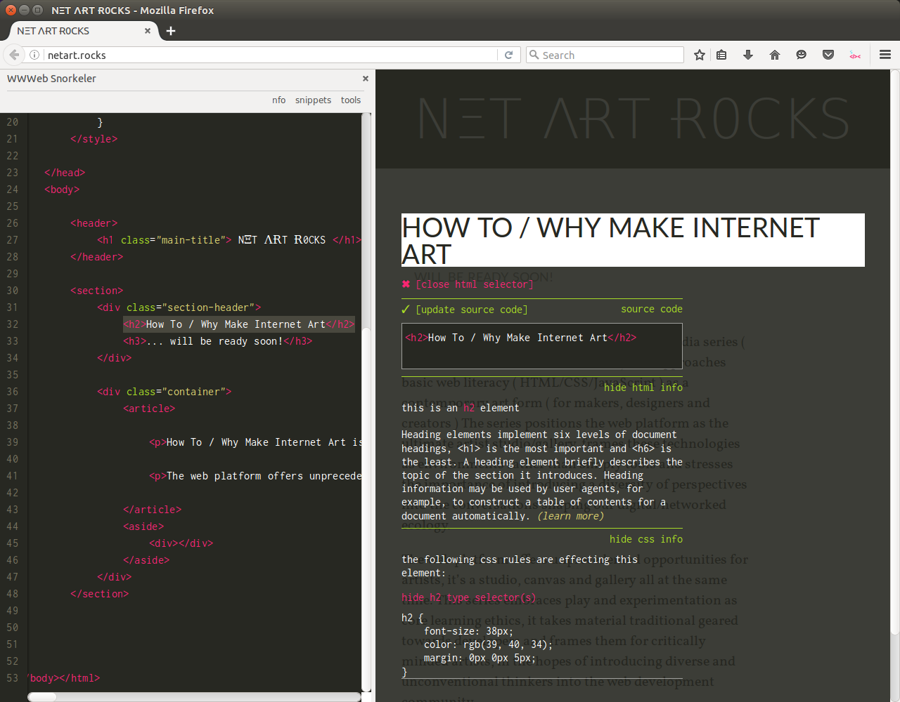

# WWWeb-Snorkeler 

...is a Firefox addon that takes u just below the wwweb's surface. interactive accompaniment to the 'How To / Why Make Internet Art' series, visit [http://netart.rocks](http://netart.rocks) to learn more

the WWWeb-Snorkeler is an implementation of my [WWWeditor project](https://github.com/nbriz/WWWEditor) ( u can check out dependencies + credz there ) ++ beyond all that stuff, the WWWeb-Snorkeler also makes use of [js-beutify](https://github.com/beautify-web/js-beautify) for cleaning up code.

# How To / Why Make Internet Art

...is a hypermedia series ( interactive video and Firefox addon ) that approaches basic web literacy ( HTML/CSS/JavaScript ) as a contemporary art form ( for makers, designers and creators ) The series positions the web platform as the ultimate artist studio/gallery, frames these technologies as environments rather than simply tools and stresses the importance of introducing a diversity of perspectives into the conversations shaping our digital/networked ecology.
